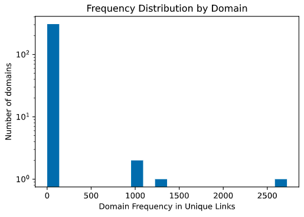
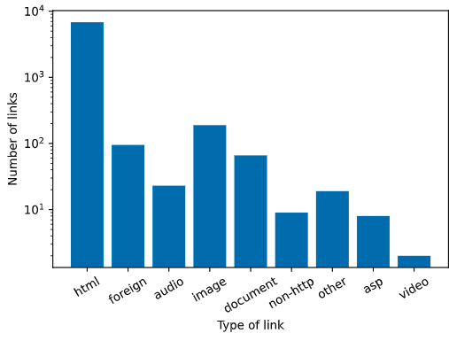
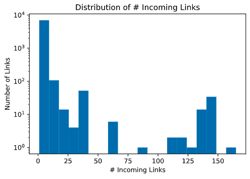
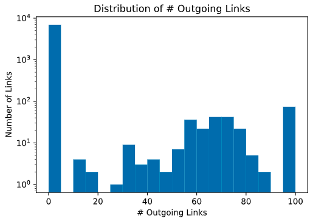

# Crawling and Link Statistics
CS6200 Information Retrieval HW3 | Yuting Sun

HW description: [hw_crawling.pdf](hw_crawling.pdf)


### Part1 Crawling

- Define a topic: Nobel Prize

- A list of seed urls (getting from top-5 google search results)

  'https://www.nobelprize.org', 

  'https://en.wikipedia.org/wiki/Nobel_Prize', 

  'https://www.britannica.com/topic/Nobel-Prize', 

  'https://www.facebook.com/nobelprize/', 

  'https://www.nytimes.com/topic/subject/nobel-prizes'


##### Implement Single-Thread Focused Crawler

- Visit the links in a breadth-first-search manner

  pop the current link from task_queue

  extract new links from current link with method `extract_link()`

  add new links to task_queue

- Link normalization

  Use `urllib.parse.urlparse` to parse the url into different fractions, normalize links as `scheme://netloc/path`

- Result update and store:

  All visited links are saved in a hashtable

  Update link information while crawling, including incoming, outgoing, depth and type.

  Final result is saved to file using `pickle.dump()`.

- page selection criteria
  - If a page does not contain keyword "nobel", then skip extracting links from it.
    This prevents crawling irrelevant pages to some extent.

- Optimizing `request.get(url)` for efficiency and error-prone
  - add headers to pretend a human user agent
  - add timeout to prevent stucking from getting the page


##### How to run the code:

- move to the project directory

- run `python crawler.py` in terminal.
  The crawling log should print in the terminal
  Final result will be saved to file `link_dict_20k.pickle` in the same folder.

  The total time for crawling takes 13 min. (Total visited links: 480)


### Part2 Link Statistics

Link statiscs for crawling output is conducted in ipython notebook [Link_Statistics.ipynb](Link_Statistics.ipynb). You can open and run it with jupyter notebook. Or you can view it in this [GitHub link](https://github.com/3unyt/crawling-and-link-statistics/blob/main/Link_Statistics.ipynb) or this printed pdf version: [Link_Statistics_ipynb.pdf](Link_Statistics_ipynb.pdf).

Below is a brief summary of the statistics:

##### a. Number of unique links extracted

7211

##### b. Frequency distribution by domain



- The top-10 domains with highest frequency:

```
Rank  | Frequency     |  Domain	         
---------------------------------------
1		2723		en.wikipedia.org
2		1256		www.nobelprize.org
3		1063		www.facebook.com
4		1062		www.britannica.com
5		103			www.nytimes.com
6		72			cn.nytimes.com
7		59			kids.britannica.com
8		41			corporate.britannica.com
9		34			nobelprize.org
10		30			www.merriam-webster.com
```


##### c. Breakdown of links by type (e.g., text, image, video)

Types of link is determined by method `get_link_type`. It generally parses the `.xx` suffix of a url.

Summary of link types:

```python
{'html': 6800,
'foreign': 95,
'audio': 23,
'image': 189,
'document': 66,
'non-http': 9,
'other': 19,
'asp': 8,
'video': 2}
```




##### d. Average link depth

| Depth | Number of Links |
| ----- | --------------- |
| 1     | 5               |
| 2     | 397             |
| 3     | 6809            |

- Average link depth = 2.944


##### e. Incoming and Outgoing Links

For each crawled page, compute the number of incoming and outgoing links. Report the top-25 pages with the highest number of incoming and outgoing links.

- Incoming and outgoing links are computed during crawling, and were stored in `link_dict`. Their distributions are shown below.

|                                                |                                                |
| ---------------------------------------------- | ---------------------------------------------- |
|  |  |


- Note: there are many links reaches the max link limit (=100) for a single page. This is because some pages have far more than 100 links (eg. a typical wikipedia page has 1000+ links). If the max link limit is higher, then most of the links would come from wikipedia.


- Top25 links with highest #incomings

```
Rank| # In |  Url	  
----|------|---------------------------------------------
1	90		https://www.nobelprize.org
2	89		https://www.nobelprize.org/prizes/facts/nobel-prize-facts/
3	89		https://www.facebook.com/nobelprize/
4	89		https://www.nobelprize.org/alfred-nobel/biographical-information/
5	89		https://www.nobelprize.org/in-depth/
6	89		https://www.nobelprize.org/education-network-nobel-prize-lessons/
7	89		https://www.nobelprize.org/public-events/
8	89		https://www.nobelprize.org/press-room/
9	89		https://www.nobelprize.org/nomination/archive/
10	89		https://www.nobelprize.org/nomination/nomination-and
			-selection-of-medicine-laureates/
11	89		https://www.nobelprize.org/events/nobel-prize-summit/washington-2020/
12	89		https://www.nobelprize.org/nobel-prize-dialogue/
13	89		https://www.nobelprize.org/nomination/nomination-and
			-selection-of-physics-laureates/
14	89		https://www.nobelprize.org/nobel-prize-inspiration-initiative/
15	89		https://www.nobelprize.org/nobel-week-dialogue/
16	89		https://www.nobelprize.org/nomination/nomination-and
			-selection-of-literature-laureates/
17	89		https://www.nobelprize.org/nobel-prize-concert/
18	89		https://www.nobelprize.org/nomination/nomination
			-and-selection-of-peace-prize-laureates/
19	89		https://www.nobelprize.org/alfred-nobel/alfred-nobels-will/
20	89		https://www.nobelprize.org/education-network-nobel-prize-teacher-summit/
21	89		https://www.nobelprize.org/nomination/nomination
			-and-selection-of-chemistry-laureates/
22	89		https://www.nobelprize.org/nomination/nomination
			-and-selection-of-laureates-in-economic-sciences/
23	89		https://www.nobelprize.org/nobel-prize-award-ceremonies/
24	88		https://www.nobelprize.org/prizes/physics/
25	88		https://www.nobelprize.org/prizes/peace/


```


- Top25 links with highest #outgoings

```
Rank| #Out |  Url	  
----|------|---------------------------------------------
1	100		https://www.nobelprize.org
2	100		https://www.nobelprize.org/prizes/facts/nobel-prize-facts/
3	100		https://www.britannica.com/videos/Technology
4	100		https://www.britannica.com/browse/Technology
5	100		https://www.britannica.com/summary
6	100		https://www.britannica.com/browse/Health-Medicine
7	100		https://www.britannica.com/browse/Philosophy-Religion
8	100		https://www.britannica.com/browse/Visual-Arts
9	100		https://www.britannica.com/videos/Sports-Recreation
10	100		https://www.britannica.com/browse/World-History
11	100		https://www.britannica.com/videos/Science
12	100		https://www.britannica.com/quiz/browse
13	100		https://www.britannica.com/browse/Lifestyles-Social-Issues
14	100		https://www.britannica.com/browse/Politics-Law-Government
15	100		https://www.britannica.com/browse/Literature
16	100		https://www.britannica.com/browse/Geography-Travel
17	100		https://www.britannica.com/videos/explains
18	100		https://www.britannica.com/videos/World-History
19	100		https://www.britannica.com/browse/Science
20	100		https://www.britannica.com/videos/this-week-in-history
21	100		https://www.britannica.com/videos/Politics-Law-Government
22	100		https://www.britannica.com/videos/Literature
23	100		https://www.britannica.com/videos/Lifestyles-Social-Issues
24	100		https://www.britannica.com/browse/Entertainment-Pop-Culture
25	100		https://www.britannica.com/
```


##### f. Domain rank

Plot the top-50 domains ranked by highest number of incoming links. Note that this is a computation for domains (e.g., cnn.com, bbc.co.uk) and not individual pages.

```
Rank| #In  |  Domain
----|------|---------------------------------------------
1	8598		www.nobelprize.org
2	3618		en.wikipedia.org
3	2755		www.britannica.com
4	2304		www.facebook.com
5	309		twitter.com
6	244		www.linkedin.com
7	225		www.nytimes.com
8	213		www.youtube.com
9	159		www.instagram.com
10	128		corporate.britannica.com
11	120		
12	117		cn.nytimes.com
13	72		kids.britannica.com
14	56		help.nytimes.com
15	50		facebook.com
16	40		nobelprize.org
17	34		premium.britannica.com
18	33		cdn.britannica.com
19	33		www.merriam-webster.com
20	32		www.nobelprizemedicine.org
21	31		commons.wikimedia.org
22	27		nobelweeklights.se
23	26		l.facebook.com
24	26		www.kva.se
25	24		instagram.com
26	24		www.wikidata.org
27	22		www.nytco.com
28	21		web.archive.org
29	19		upload.wikimedia.org
30	16		youtu.be
31	14		cloud.email.britannica.com
32	14		www.pinterest.com
33	11		nytmediakit.com
34	11		spiderbites.nytimes.com
35	11		myaccount.nytimes.com
36	11		www.tbrandstudio.com
37	11		ar.wikipedia.org
38	10		pt-br.facebook.com
39	10		de-de.facebook.com
40	10		hi-in.facebook.com
41	10		www.oculus.com
42	10		ko-kr.facebook.com
43	10		portal.facebook.com
44	10		es-la.facebook.com
45	10		ja-jp.facebook.com
46	10		fr-fr.facebook.com
47	10		messenger.com
48	10		developers.facebook.com
49	10		it-it.facebook.com
50	10		pay.facebook.com
```


